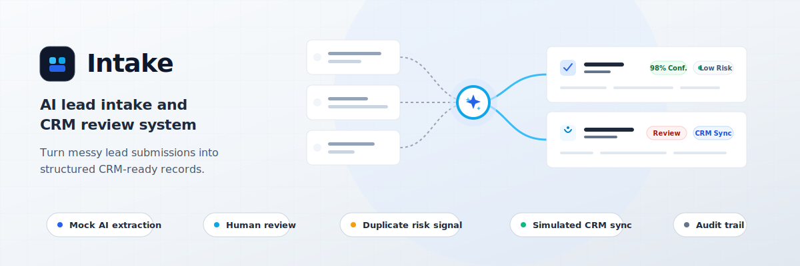

# Intake



The problem this solves:
Inbound leads and partner deal submissions often arrive through email, forms, spreadsheets, and partner handoffs. Sales teams waste time copying data into CRMs, checking for missing information, spotting duplicates, and deciding whether the lead is ready for follow-up. Intake centralizes that workflow. Uploaded document ingestion is planned but not implemented yet.

How it works:
Intake is an AI lead intake and CRM review system. It turns messy lead emails, forms, and partner referrals into structured CRM-ready records with confidence scores, duplicate risk signals, missing-info detection, human review, simulated CRM sync, and audit logs. A reviewer can see messy submissions become structured lead records, inspect what mock AI extracted, correct uncertain fields, approve the record, and simulate syncing it to a CRM pipeline.

Features:
- Submissions API for ingesting raw leads from supported sources
- Mock AI extraction mapping messy text to structured fields
- Confidence scoring for extracted fields
- Human-in-the-loop review workflow (approve or mark for review)
- Simulated CRM sync capability
- Comprehensive audit logging of all actions

Stable backend API contract:
- `GET /api/health`
- `POST /api/submissions`
- `GET /api/submissions`
- `GET /api/submissions/{submission_id}`
- `POST /api/submissions/{submission_id}/extract`
- `PATCH /api/submissions/{submission_id}/review`
- `POST /api/submissions/{submission_id}/approve`
- `POST /api/submissions/{submission_id}/crm-sync`
- `GET /api/submissions/{submission_id}/audit`

Current mocked behavior and Phase 1 limitations:
- AI extraction is mocked by default through `MockProvider`.
- CRM sync is simulated and persists simulated sync metadata.
- Duplicate detection is currently a risk signal, not a full matching engine.
- Uploaded document ingestion is planned and is not implemented yet.
- Auth is not implemented as a real authentication system yet.
- Notifications are planned or stubbed and are not wired to email, Slack, or other channels.

Stack:
- Backend: FastAPI, SQLAlchemy, Pydantic, SQLite for local development
- Frontend: React, TypeScript, Tailwind CSS
- Testing: Pytest for backend, Node test runner for the frontend API client

Local development:
1. Create a backend virtual environment and install dependencies:
   ```bash
   cd backend
   pip install -r requirements.txt
   ```
2. Start the backend API:
   ```bash
   uvicorn app.main:app --reload
   ```
3. Install frontend dependencies and start the frontend dev server in a separate terminal:
   ```bash
   cd frontend
   npm install
   npm run dev
   ```
4. Open the frontend dev server URL and test the review pipeline. Local frontend development calls the backend API separately.

Portfolio deployment:
- The repository includes `render.yaml` for one Render web service.
- Render installs backend dependencies, installs frontend dependencies, builds `frontend/dist`, and starts FastAPI.
- In production, FastAPI serves the built React frontend for non-API routes and keeps API routes under `/api`.
- Use `/api/health` as the health check path.

Deployment environment variables:
- `DATABASE_URL`: required. Use SQLite only for local development. For a persistent deployed demo, use a managed Postgres database URL.
- `ENVIRONMENT`: set to `production` for deployment.
- `CORS_ORIGINS`: comma-separated allowed origins. For a single-service same-origin Render deployment, set this to the deployed site origin. For local development, the default allows `http://localhost:5173` and `http://127.0.0.1:5173`.

Do not commit secrets. Keep real environment values in Render or local `.env` files only. Render's service filesystem is ephemeral, so SQLite data on the service can be lost across deploys or restarts. Use Postgres through `DATABASE_URL` for persistent portfolio data, or reseed demo data deliberately if persistence is not needed.

Security:
- No real secrets are committed to the repository (see `.env.example`).
- Pydantic models are used for strict input validation.
- Every AI extraction, human review, and CRM sync action is recorded in the audit log.

Tests:
- Backend tests are provided via Pytest. Run `python -m pytest` in the `backend` directory.
- Frontend tests run with `npm test` in the `frontend` directory.

Project structure:
- `backend/app/`: Backend application code (FastAPI, database models, services)
- `backend/tests/`: Backend test suite
- `frontend/`: React frontend application
- `docs/`: Project architecture, security, and demo scripts
